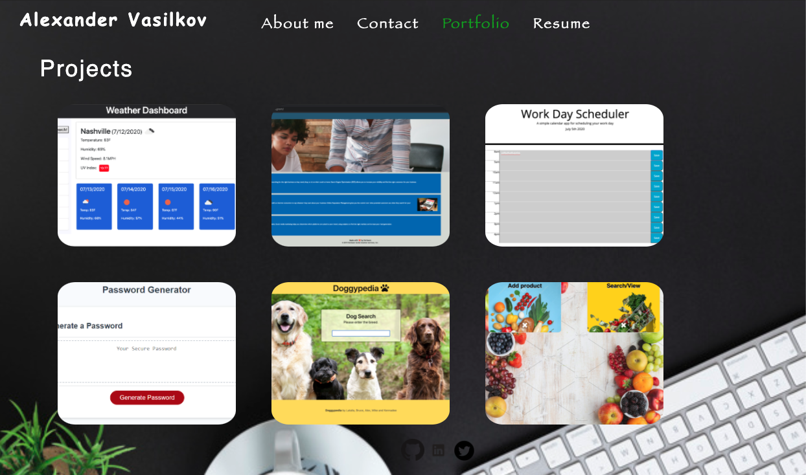

# React Portfolio
1. [ Description. ](#desc)
2. [ Questions.](#ques)
3. [ Screenshot.](#scrsh)

## Description:
### Being a web developer means being part of a community. You’ll need a place to share your projects not only if you're applying for jobs or working as a freelancer but also so that you can share your work with fellow developers and collaborate on future projects.

## Questions:
### My gitHub profile:
## https://github.com/Alex2055
### Email me:
## alexfromnashville@gmail.com

 #
 

    